# USB to N64 gamepad adapter

This adapter allows you to use USB gamepads with Nintendo N64 console.

Features:

- Support for XBOX 360 Wired, XBOX ONE, HID gamepads
- Support for USB mouses
- Support for USB keyboards
- Controller (memory) pak support (saving to Raspberry Pi Pico flash on console power off)
- Rumble pak support for XBOX 360 Wired and XBOX ONE gamepads

## Build

You will need:

- one Raspberry Pi Pico board
- a micro usb host OTG cable with power (OTG Y cable)
- a cable from old N64 controller or an extension cable cord for N64 controller
- one of supported gamepads
- a power supply for Raspberry Pi Pico

Cut the cable from the old gamepad or extension cable, strip the white (data) and black (ground) wires. Red (power) cut off - it is not needed. Solder the cable to the Raspberry Pi Pico board - black wire (ground) to the GND pad, white wire (N64 controller data) to the GP14 pad. Flash the adapter firmware to the board.

## Usage

Build or download firmware from release, upload to the Raspberry Pi Pico.

Connect the board cable to the N64 and connect the OTG Y cable to the board. Connect the gamepad to the USB host port of the OTG Y cable. Connect the OTG Y cable to a power supply.

Turn on your game console.

On xbox gamepads, the xbox button turns on the rumble pak (fast blinking of the on-board LED). The controller pak is saved automatically when the console is turned off.

## Photos

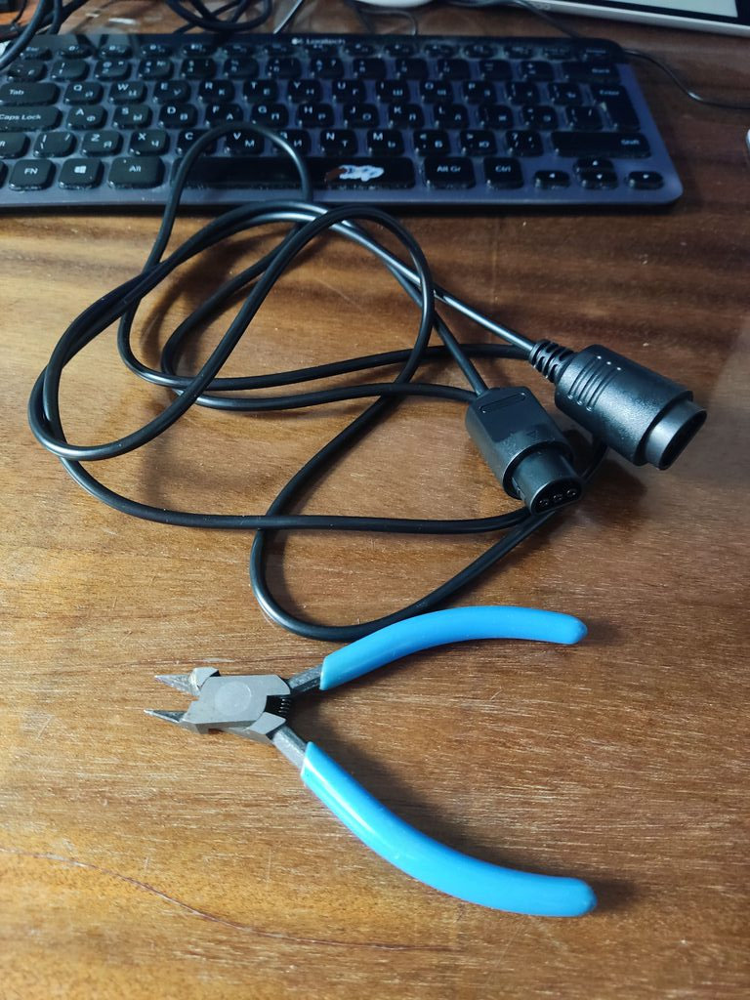

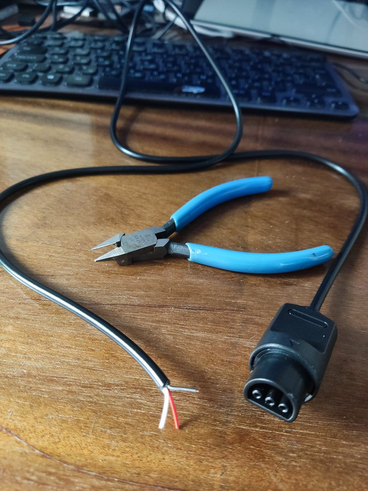

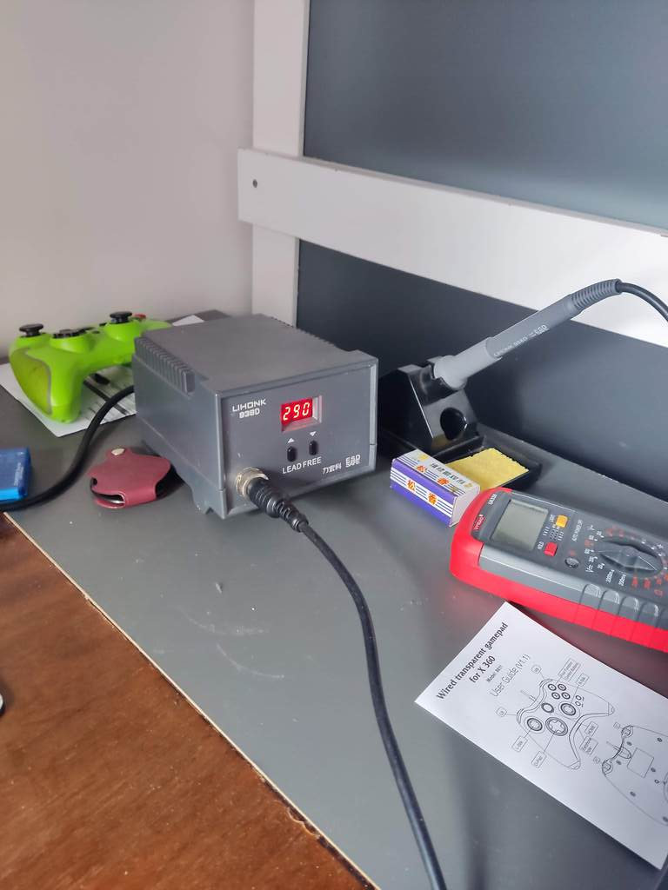

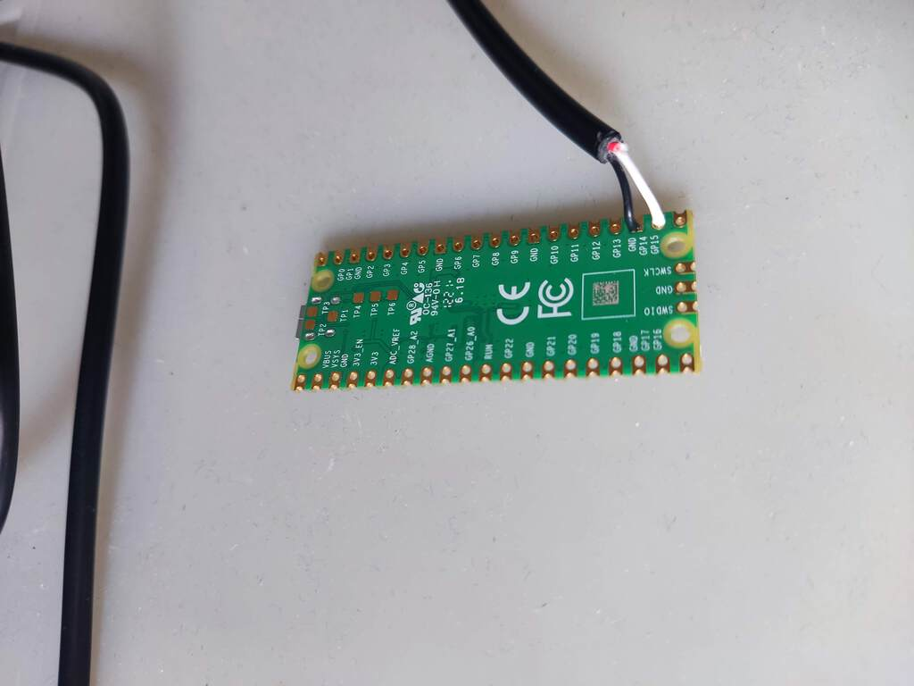

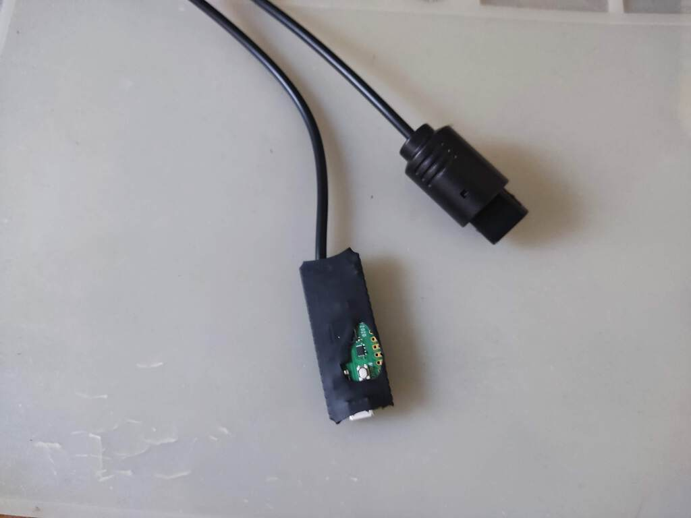

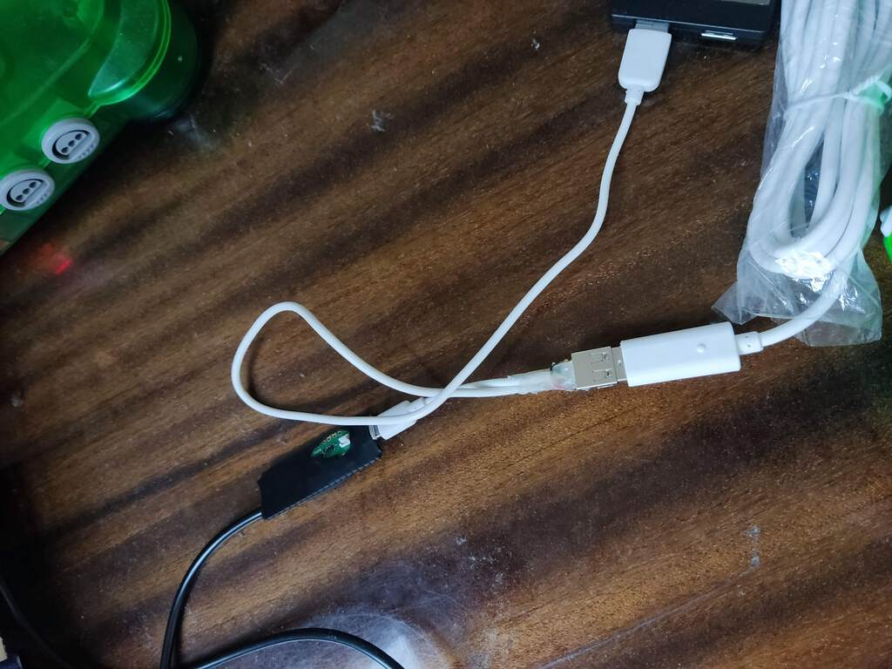

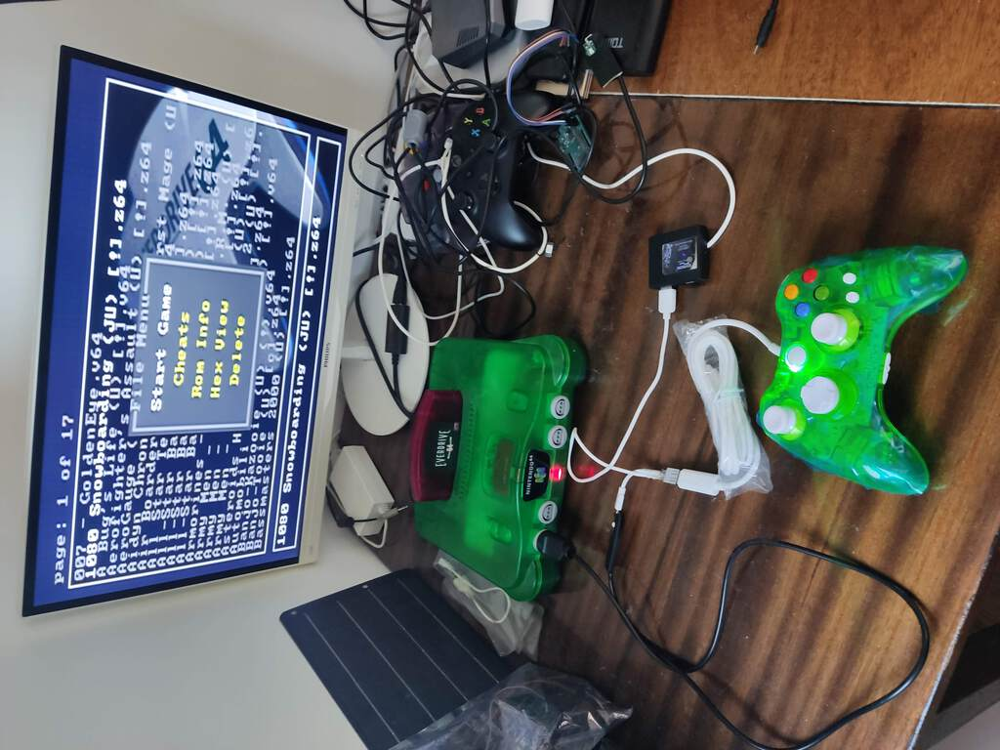

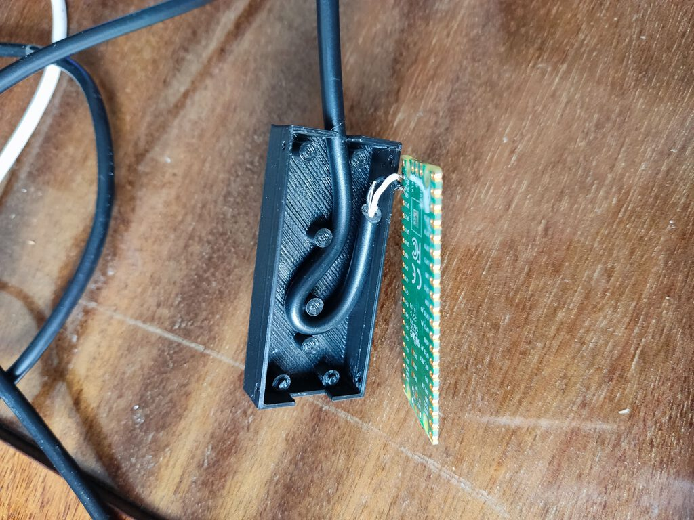

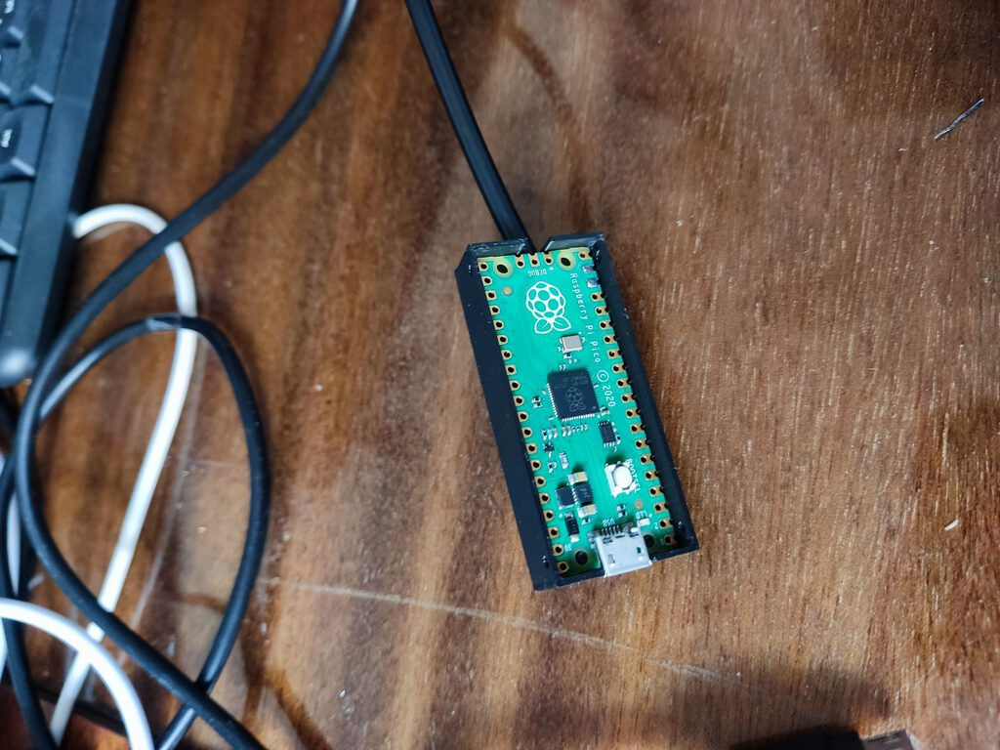

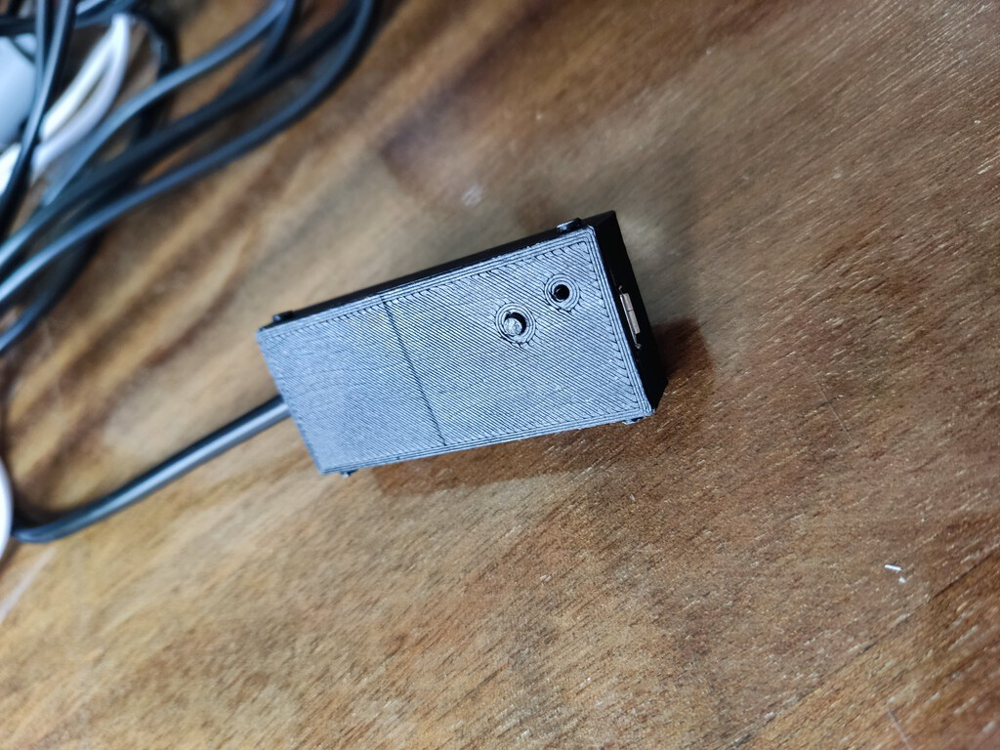

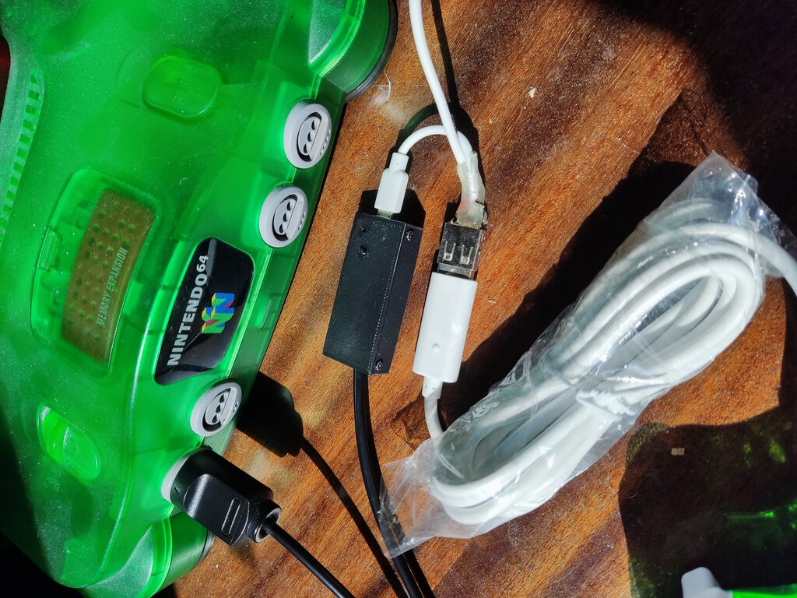

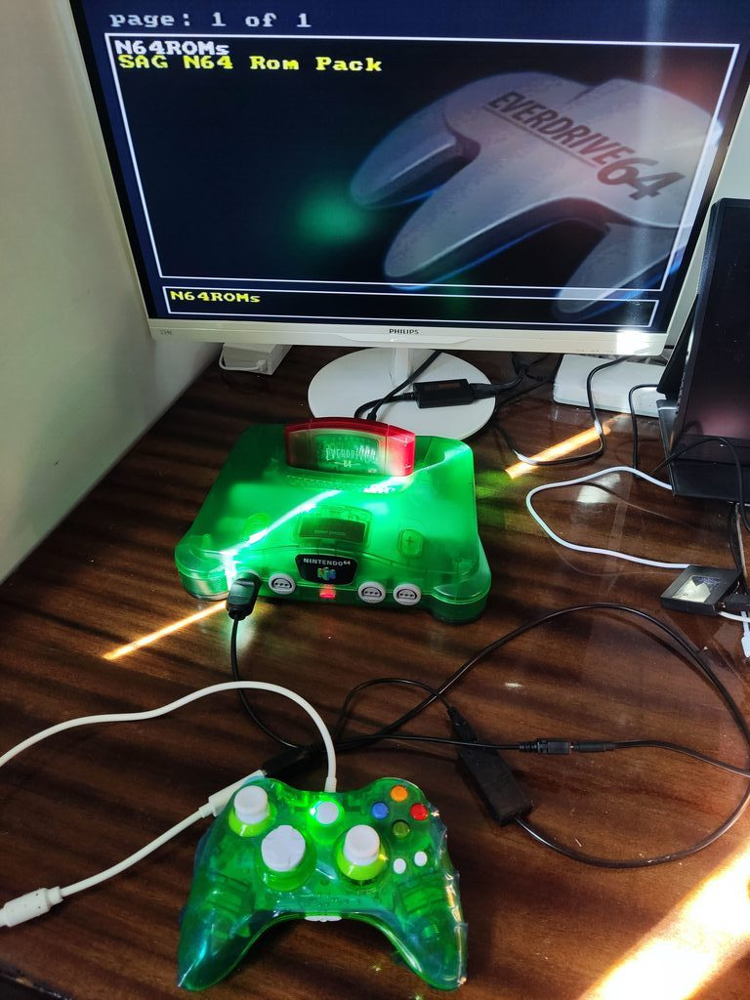

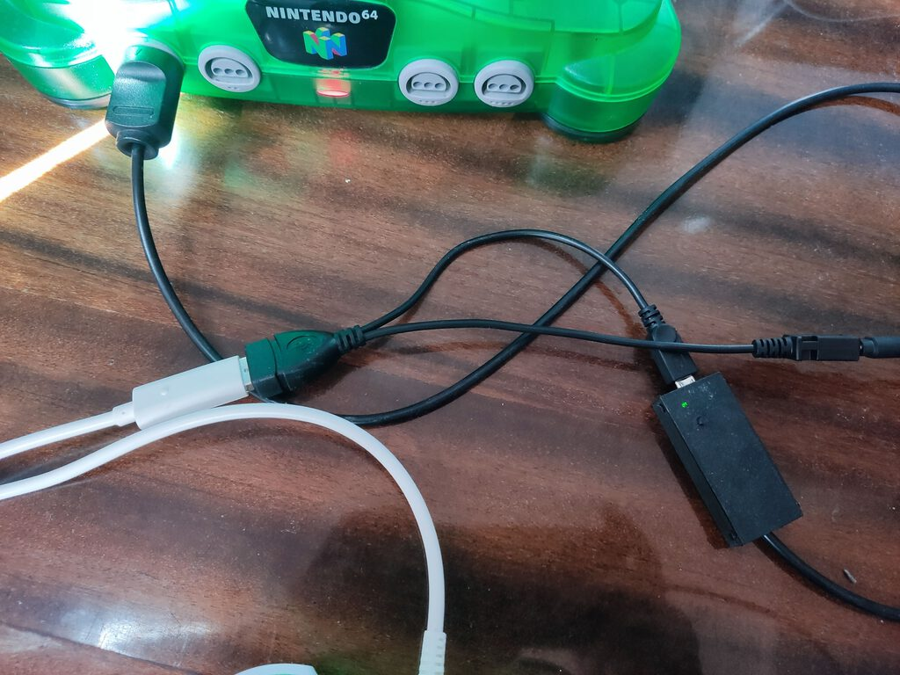

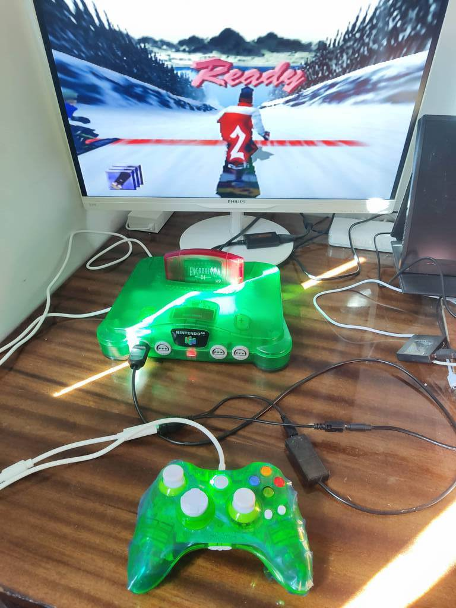
